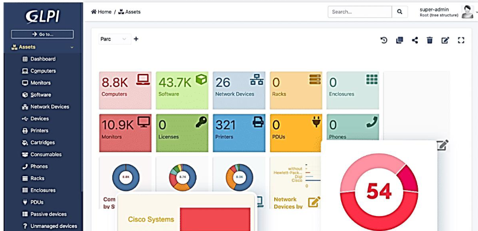
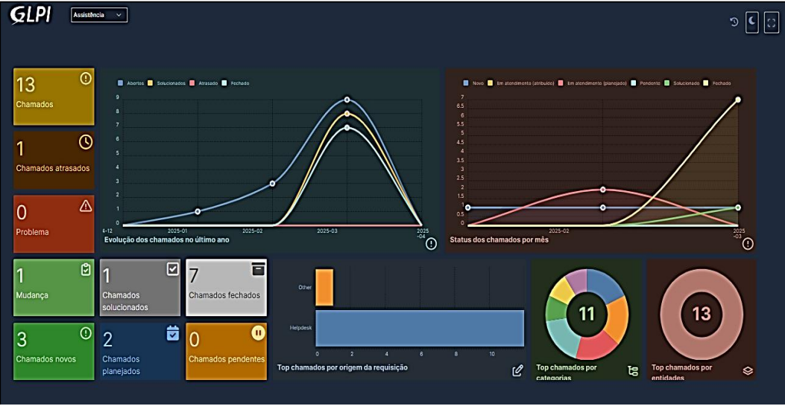
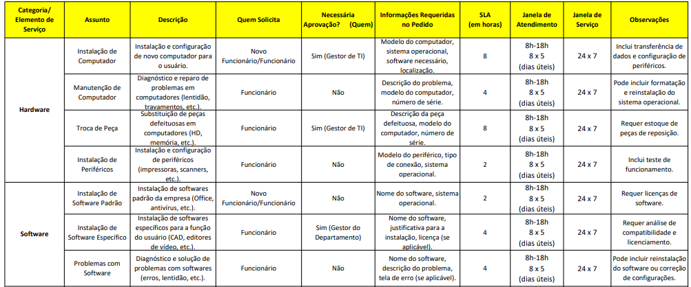
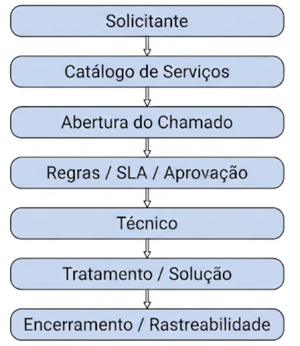

# GLPI — Service Desk / ITSM

  

**Natureza:** Acadêmico / Simulação Corporativa ✔

---

## Visão Geral

Avaliação técnica e operacional do GLPI como solução centralizada de Service Desk / ITSM, realizada em ambiente de laboratório com cenário de simulação corporativa.

O projeto avaliou a capacidade da plataforma de apoiar processos estruturados de Gestão de Serviços de TI, considerando a estruturação de catálogo de serviços, definição de SLAs, controle de acesso baseado em funções (RBAC), fluxos de atendimento, aprovações e mecanismos de rastreabilidade.

A avaliação também realizou uma análise comparativa das funcionalidades observadas com referências de ITIL v4, COBIT 2019 e ISO/IEC 20000, permitindo identificar capacidades, limitações e oportunidades de melhoria relacionadas à configuração da plataforma, aos processos e à governança de serviços.

## Indicadores do Projeto

| Indicador | Resultado |
|---|---:|
| Categorias de serviços | **8** |
| Serviços parametrizados | **20+** |
| Perfis de acesso avaliados | **3** |
| Frameworks / referenciais analisados | **3** |

## Contexto e Problema

Para fins deste projeto, foi desenvolvido um cenário de simulação corporativa baseado em uma empresa de serviços gerenciados de TI (MSP) de porte médio, especializada em suporte técnico corporativo, Service Desk, gestão de ativos e infraestrutura de rede, com processos orientados por referências como ITIL e COBIT.

O cenário analisado (AS-IS) apresentava baixa rastreabilidade, inconsistência operacional e dificuldade na mensuração de desempenho, decorrentes do uso descentralizado de canais de suporte, como e-mail, telefone e mensagens.

Esse modelo dificultava:
- A padronização dos atendimentos;
- O acompanhamento de níveis de serviço;
- A definição de responsabilidades;
- A rastreabilidade das solicitações;
- A consolidação de informações para análise de desempenho.

Diante desse contexto, o projeto avaliou o GLPI como plataforma centralizada de Service Desk / ITSM, buscando estruturar, padronizar e organizar o processo de atendimento de TI.

## Objetivos

- Avaliar a funcionalidade e usabilidade do GLPI nos perfis de Solicitante, Técnico e Administrador.
- Estruturar um Catálogo de Serviços de TI com categorias, SLAs, janelas de atendimento e fluxos de aprovação.
- Avaliar mecanismos de controle de acesso e responsabilidades por perfil.
- Analisar os fluxos de abertura, atendimento, acompanhamento e encerramento de chamados.
- Comparar as funcionalidades observadas com práticas e conceitos de ITIL v4, COBIT 2019 e ISO/IEC 20000.
- Identificar lacunas de configuração, processos e governança.
- Elaborar recomendações de melhoria para a estrutura de atendimento avaliada.

## Escopo

### Incluído
- Provisionamento e configuração do GLPI em ambiente de laboratório.
- Estruturação do Catálogo de Serviços de TI.
- Definição de categorias e campos obrigatórios.
- Parametrização de SLAs e janelas de atendimento.
- Configuração e avaliação de perfis de acesso.
- Definição de regras e fluxos de aprovação.
- Execução de testes funcionais e de usabilidade.
- Avaliação comparativa com boas práticas de ITSM e governança.
- Elaboração de documentação técnica, evidências e matriz de recomendações.

### Excluído
- Integrações com sistemas externos de ERP ou RH.
- Integração com ferramentas de monitoramento em tempo real.
- Implantação em ambiente produtivo.
- Automação de processos corporativos fora do escopo do Service Desk.

## Limitações da Avaliação

A avaliação foi conduzida em ambiente de laboratório e simulação corporativa, sem impacto sobre operações reais de produção.

Os resultados representam o comportamento observado no cenário configurado e não constituem uma validação de implantação produtiva, auditoria formal ou certificação de conformidade.

## Atuação no Projeto

As principais atividades realizadas compreenderam:

- Provisionamento e configuração do ambiente GLPI;
- Estruturação do Catálogo de Serviços;
- Parametrização de SLAs, horários e regras de atendimento;
- Configuração e avaliação de perfis e permissões (RBAC);
- Definição e teste de fluxos de aprovação;
- Execução de testes funcionais e de usabilidade;
- Análise dos fluxos de atendimento e rastreabilidade;
- Avaliação comparativa com ITIL v4, COBIT 2019 e ISO/IEC 20000;
- Identificação de gaps e oportunidades de melhoria;
- Produção da documentação técnica e evidências do projeto.

## Metodologia e Abordagem

A avaliação foi estruturada em cinco etapas.

1. **Configuração do Ambiente**: Provisionamento do GLPI em ambiente de laboratório isolado, com acesso controlado por VPN.
2. **Estruturação do Serviço**: Definição das categorias de atendimento, campos obrigatórios, regras de aprovação, SLAs e janelas de atendimento.
3. **Testes Funcionais, Usabilidade e RBAC**: Execução de fluxos ponta a ponta utilizando os diferentes perfis de acesso (Solicitante, Técnico, Administrador). Foram avaliadas navegação, abertura e acompanhamento de chamados, responsabilidades, permissões, visibilidade das informações e limitações de cada perfil.
4. **Avaliação Comparativa**: As funcionalidades observadas foram comparadas com práticas e conceitos relacionados a ITIL v4, COBIT 2019 e ISO/IEC 20000, com caráter comparativo e acadêmico, considerando o cenário e a configuração implementados no laboratório.
5. **Análise de Gaps e Recomendações**: Identificação das limitações encontradas na configuração avaliada e elaboração de propostas de melhoria relacionadas a processos, parametrização, controle de acesso e governança.

## Frameworks e Boas Práticas

  
  
  
  

- **ITIL v4**: Utilizado como referência para conceitos relacionados à estruturação do Catálogo de Serviços, Gestão de Incidentes, Requisições e Gestão de Ativos de TI.
- **COBIT 2019**: Utilizado como referência de governança, com foco no Domínio DSS (Deliver, Service and Support), especialmente nos aspectos relacionados à entrega e suporte de serviços.
- **ISO/IEC 20000**: Utilizada como referência para conceitos de Gestão de Serviços de TI, incluindo definição de níveis de serviço, responsabilidades e Acordos de Nível de Serviço (SLAs).

## Tecnologias e Ferramentas

  
  

- **Service Desk / ITSM**: GLPI
- **Rede / VPN**: ZeroTier
- **Documentação**: Markdown e PDF
- **Modelagem e controle**: Planilhas eletrônicas
- **Ambiente**: Laboratório de simulação corporativa

## Solução Implementada

O GLPI foi utilizado como plataforma centralizada de Service Desk / ITSM, com um catálogo estruturado em oito categorias principais:
- Hardware
- Software
- Rede
- Acessos e Segurança
- E-mail
- Telefonia
- Sistemas Corporativos
- Outros

  

  

A configuração contemplou:
- Catálogo de Serviços;
- Perfis de acesso;
- Controle de acesso baseado em funções (RBAC);
- Regras de aprovação;
- Campos obrigatórios;
- SLAs;
- Janelas de atendimento;
- Fluxos de abertura e tratamento de chamados;
- Mecanismos de acompanhamento e rastreabilidade.

### Catálogo de Serviços

O catálogo foi estruturado em oito categorias de atendimento, contemplando os principais tipos de demanda considerados no cenário de simulação.

  

### Fluxo Operacional de Atendimento

  

---

## Principais Resultados

A avaliação demonstrou a viabilidade do GLPI como plataforma centralizada para o cenário proposto, permitindo estruturar o atendimento por meio de catálogo de serviços, SLAs, perfis de acesso, fluxos de aprovação e mecanismos de rastreabilidade.

Entre os principais resultados observados:

- Estruturação de **8 categorias e 20+ serviços**;
- Avaliação de **3 perfis de acesso**;
- Parametrização e associação de **SLAs aos serviços**;
- Implementação e teste de **fluxos de aprovação**;
- Centralização do registro e acompanhamento dos chamados;
- Identificação de gaps relacionados à configuração, processos e governança;
- Comparação do cenário avaliado com **ITIL v4, COBIT 2019 e ISO/IEC 20000**.

---

## Documentação, Evidências e Recursos

- [Relatório Técnico de Avaliação de Service Desk - GLPI](docs/REPORT%20-%20AVALIAÇÃO%20DE%20SERVICE%20DESK%20-27.04.2025.pdf)
- [Relatório de Alinhamento GLPI vs. Melhores Práticas do COBIT, ITIL e ISO/IEC 20000](docs/COMPARA%C3%87%C3%83O%20COM%20AS%20MELHORES%20PR%C3%81TICAS%20DO%20COBIT%20-%20ITIL%20-%20ISO%2020000.pdf)
- [Catálogo de Serviços de TI - GLPI](docs/CATALOGO%20DE%20SERVI%C3%87OS%20DE%20TI%20-%20GLPI%2021.04.2025.pdf)
- [Catálogo ITIL e Mapeamento de SLAs](docs/Catalogo%20ITIL%2002.pdf)

---

###### 🔒 Nota de Confidencialidade

###### *Tratando-se de um projeto desenvolvido em ambiente de simulação corporativa e laboratório de testes, quaisquer topologias de rede, endereços IP, credenciais de acesso ou configurações específicas mencionadas na documentação original foram omitidas ou sanitizadas neste repositório, preservando as boas práticas de segurança da informação.*

---

## Contato

---

## 🧭 Navegação do Portfólio

[⬅️ Voltar ao Perfil Principal](https://github.com/mighcruz)

[📂 Voltar ao Hub Central de Projetos](https://github.com/mighcruz/portfolio-ti)
